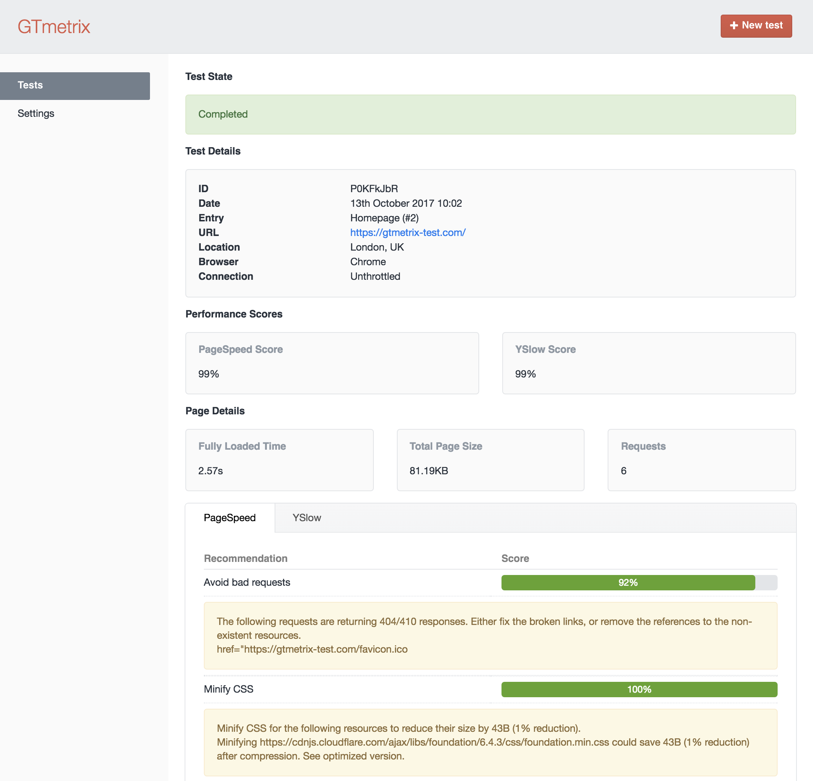

# GTmetrix plugin for Craft CMS 3.x

GTmetrix gives you insight on how well your entries load and provides actionable recommendations on how to optimise them.

## Requirements

This plugin requires Craft CMS 3.0.0-beta.23 or later.

## Installation

To install the plugin, follow these instructions.

1. Open your terminal and go to your Craft project:

        cd /path/to/project

2. Then tell Composer to load the plugin:

        composer require lukeyouell/craft3-gtmetrix

3. In the Control Panel, go to Settings → Plugins and click the “Install” button for GTmetrix.

## Configuring GTmetrix

Upon successful installation you will be required to supply valid credentials to successfully communicate with the GTmetrix API.

A GTmetrix account is required, if you don't already have one [click here to create one](https://gtmetrix.com/pro).

Free & paid plans are available.

## Using GTmetrix

Once you have provided valid credentials you will be able to make GTmetrix test requests.

### Making a Request

- Click the "New test" button
- Select an entry, location, browser and connection type
- Set additional conditions such as HTTP authentication, cookies, AdBlock and resource whitelisting/blacklisting
- Submit the request

### Test states

Once a test has been successfully submitted, there are five possible states:

##### 1. Requested

The request is waiting for a response.

##### 2. Queued

The request has been accepted and placed in a queue.

##### 3. Started

Testing has been initiated.

##### 4. Error

There was a problem with the test, an description of the error will be provided.

##### 5. Completed

The test has been completed and is now available for you to view.

## GTmetrix Roadmap

Some things to do, and ideas for potential features:

- Ability to re-test entry
- Restrict abilities if API credentials are missing
- Delete records
- Make test resources available

Brought to you by [Luke Youell](https://github.com/lukeyouell)
